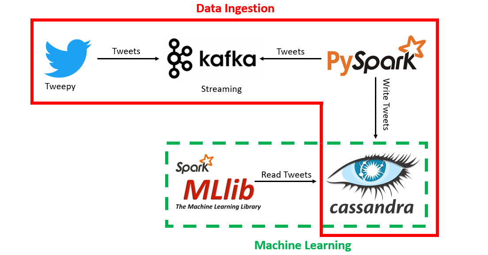

# Streaming Data Pipeline

This is a project for the course Data Architecture from Università di Milano Bicocca.

### Goals:
- Real-time streaming data management and collection
- Analysis of collected data using Machine Learning techniques to identify clusters
- Performance evaluation of the proposed solution

### Technologies: 
- Spark (PySpark and MLlib)
- Cassandra
- Kafka
- Docker

### Architecture:

### Clusters:

### Setup:
- Kafka:
    - cd kafka-docker
    - docker-compose up -d
- Cluster Cassandra:
    - node1: docker run --name cas1 -p 9042:9042  -v your_path/node1:/var/lib/cassandra/data  -e CASSANDRA_CLUSTER_NAME=MyCluster  -e CASSANDRA_ENDPOINT_SNITCH=GossipingPropertyFileSnitch -e
    - node2: CASSANDRA_DC=datacenter1 -d cassandra
			docker run --name cas2 -v yuor_path/node2:/var/lib/cassandra/data -e CASSANDRA_SEEDS= IP -e CASSANDRA_CLUSTER_NAME=MyCluster -e CASSANDRA_ENDPOINT_SNITCH=GossipingPropertyFileSnitch -e CASSANDRA_DC=datacenter1 -d cassandra
    - useful commands: 
        - docker run [id_container] --> run an image inside of a container
		- docker exec -it cas1 nodetool status --> cluster status
		- docker exec -it cas1 cqlsh --> cqlsh
